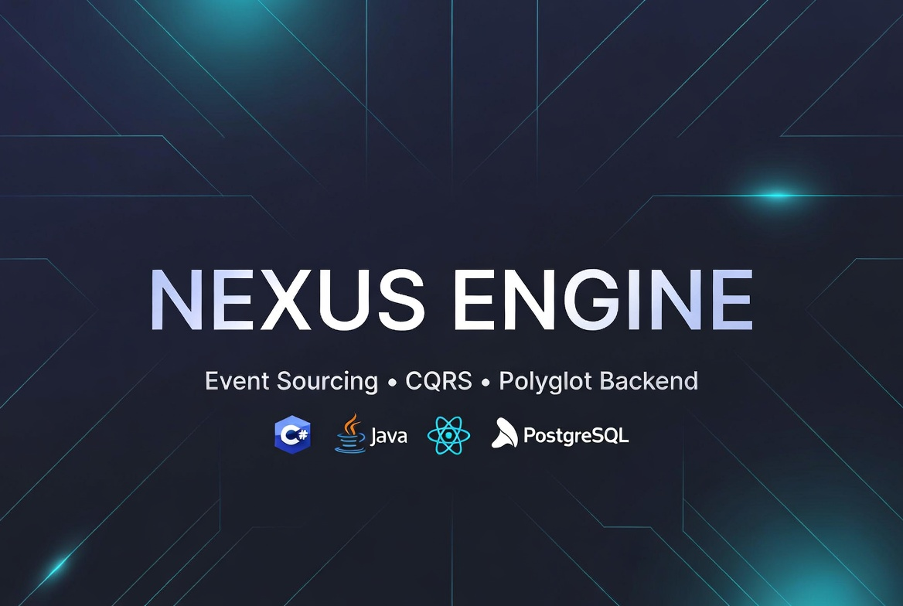

# Nexus Engine

<div align="center">
  
</div>

<br>

A simulated order/betting engine built to demonstrate production-grade backend engineering skills relevant to iGaming and Fintech companies.

Nexus Engine is not a commercial product. It is a technical portfolio project that showcases mastery of transactional systems, concurrency, real-time communication, and configurable business rules.

### **Documentation**
- [Nexus Engine](https://docs.google.com/document/d/1_g5yustt4jpWbeg5F9ApeEEyxlwxWvcyzC5pAtTxDK4/edit?tab=t.0#heading=h.cfhcybw6q3iy)
- [Network Architecture and Types (LAN & Infrastructure)](https://docs.google.com/document/d/1UEUlb57QonA9WqvT7gJie-Xfa9JTI5mgUw0x3dwKTYE/edit?tab=t.0#heading=h.8f3dvsb1xdnq)
- [Phase 1](https://github.com/Mike014/Nexus-Engine/blob/main/Phase1.md)
- [Phase 2](https://github.com/Mike014/Nexus-Engine/blob/main/Phase2.md)

---

## What This Project Demonstrates

- **Event Sourcing** — every state change is recorded as an immutable domain event. The event store is the source of truth. Current state is a projection derived from events.
- **CQRS** — strict separation between write operations (Commands) and read operations (Queries) via MediatR.
- **Concurrency control** — progressive strategy: Pessimistic Locking (Phase 2) migrated to Optimistic Locking (Phase 3), documented as a conscious engineering decision.
- **Atomic dual-write** — domain event and read-side projection written in the same database transaction. No inconsistent state possible.
- **Event replay** — any aggregate's state can be reconstructed at any point in time by replaying its event stream.
- **Order Book** — in-memory SortedDictionary, price-time priority FIFO matching, symbol BTC/USD. Orders match when taker bid >= best ask, or taker ask <= best bid.
- **Optimistic Locking** — version conflict detection via UNIQUE constraint on (aggregate_id, aggregate_version) in domain_events. Retry with random jitter (max 3 attempts, 50-300ms).
- **Order Book Recovery** — IHostedService reloads Pending and PartiallyFilled orders at startup via IServiceScopeFactory pattern.
- **Strategy Pattern** — order validation rules are encapsulated as independent, swappable strategies. Open to extension, closed to modification.
- **Idempotency** — X-Idempotency-Key header on POST /api/orders prevents duplicate placement.
- **Configurable business rules** — validation rules (limits, odds, fees) are externalized, not hardcoded.
- **Real-time updates** — WebSocket push notifications via SignalR (Phase 4).

---

## Architecture

```
┌─────────────────────────────────────────────────────┐
│                   React Frontend                    │
│              (TypeScript + Vite + nginx)            │
└──────────────────────┬──────────────────────────────┘
                       │ HTTP + WebSocket
              ┌────────▼────────────┐
              │    Backend C#        │
              │    ASP.NET Core 8    │
              │    MediatR + EF Core │
              │    SignalR           │
              └────────┬────────────┘
                       │
              ┌────────▼────────┐
              │   PostgreSQL 16  │
              │                 │
              │  domain_events  │  ← source of truth (append-only)
              │  accounts       │  ← read-side projection
              │  orders         │  ← read-side projection
              │  transactions   │  ← read-side projection
              │  idempotency_keys│
              └─────────────────┘
```

> **Architectural note:** the order book lives in-memory inside the backend process.

---

## Tech Stack

### Backend
- ASP.NET Core 8 Web API
- Entity Framework Core 8 + Npgsql
- MediatR 12 (CQRS)
- SignalR (real-time WebSocket)
- Swashbuckle (Swagger UI)

### Database
- PostgreSQL 16
- Schema owned by EF Core Migrations

### Frontend
- React 18 + TypeScript
- Vite 8
- nginx (production serving)

### Infrastructure
- Docker + Docker Compose
- GitHub Actions (CI pipeline with boot tests)

---

## Getting Started

### Prerequisites

- Docker Desktop (WSL2 backend on Windows)
- Git

### Run

```bash
git clone https://github.com/Mike014/Nexus-Engine-.git
cd Nexus-Engine
docker compose --profile csharp up --build
```

### Available endpoints

```
POST   /api/accounts              Create a new account
GET    /api/accounts/{id}         Get current account state (from projection)
POST   /api/accounts/{id}/deposit Deposit funds
GET    /api/accounts/{id}/replay  Reconstruct account state from event stream
POST   /api/orders                                   Place a new order
GET    /api/orders?accountId={id}                    Get all orders for an account
DELETE /api/orders/{orderId}?accountId={id}           Cancel a pending or partially filled order
GET    /swagger                                      Swagger UI
```

---

## Architectural Decisions

### ADR-001: Event Sourcing as persistence strategy
The event store (`domain_events`) is the source of truth. Current state (`accounts`, `orders`) is a read-side projection derived from events. This makes audit trails intrinsic, enables point-in-time replay, and eliminates the need for a separate audit table.

### ADR-002: Progressive concurrency strategy
- **Phase 2:** Pessimistic Locking (`SELECT FOR UPDATE`) — simple, correct, serializes operations on the same account.
- **Phase 3:** Migration to Optimistic Locking (version column on aggregates) — documented refactoring demonstrating awareness of trade-offs between throughput and correctness guarantees.

### ADR-003: Single active backend
The in-memory order book lives inside the C# backend process.

### ADR-004: Synchronous projections (Phases 1–3)
Read-side projections are updated in the same database transaction as the domain event write. Strong consistency, no lag between write and read model. Async projection (outbox pattern / LISTEN-NOTIFY) is documented as a future evolution.

### ADR-005: EF Core as schema master
EF Core Migrations own the schema. All columns mapped explicitly in snake_case via `IEntityTypeConfiguration`.

### ADR-006: INexusUnitOfWork abstraction
Handlers depend on `INexusUnitOfWork` interface, never on `NexusDbContext` directly. The Application layer is fully decoupled from Infrastructure. Concrete implementation lives in the Infrastructure layer and is registered as Scoped in the DI container.

---

## Development Roadmap

### Phase 1 — Foundation ✅
- Project setup (C# + React)
- Docker Compose
- Database schema: Event Store + projections
- Account CRUD with Event Sourcing
- Event replay endpoint

### Phase 2 — Transactional Engine ✅
- `INexusUnitOfWork` abstraction (ADR-006 fix)
- Place order endpoint (`POST /api/orders`)
- Validation with Strategy Pattern (account exists, active, sufficient balance)
- Pessimistic Locking (`SELECT FOR UPDATE`)
- Request idempotency (`X-Idempotency-Key` header)
- Transactions projection (atomic write on order placement)
- Get orders endpoint (`GET /api/orders?accountId={id}`)

### Phase 3 — Order Book and Matching ✅
- Buy/sell matching engine (price-time priority, in-memory SortedDictionary, symbol BTC/USD)
- Partial order fills
- Order lifecycle: Pending → PartiallyFilled → Filled / Cancelled
- Migration: Pessimistic → Optimistic Locking (version conflict via UNIQUE constraint on domain_events, retry with jitter)
- Idempotency: X-Idempotency-Key header on POST /api/orders
- Strategy Pattern: order validation (AccountExists, AccountActive, SufficientBalance)
- Order book recovery on restart (IHostedService reloads Pending and PartiallyFilled orders)

### Phase 4 — Real-time
- SignalR push
- Live order book, balance updates, trade feed
- React dashboard with live data

### Phase 5 — Observability and Polish
- Structured logging (Serilog)
- Health checks
- Architecture diagrams and ADR documentation
- Event replay demonstration
- Metrics (Prometheus + Grafana, optional)

---

## Domain Model (iGaming / Fintech)

Nexus Engine models a betting exchange (inspired by Betfair) and a financial trading platform (inspired by LMAX):

- **Back = Buy** — "I bet €10 that X wins at odds 3.0"
- **Lay = Sell** — "I offer the counterpart at odds 3.0"
- **Price-time priority matching** — orders matched by best price first, FIFO at equal price
- **Partial fills** — an order can be partially matched, remainder stays in the book
- **Reserved balance** — funds are reserved (not deducted) when a Buy order is placed; deducted only on fill
- **Configurable commission** — exchange fee on net winnings, never on stake

---

## References

- [LMAX Architecture](https://martinfowler.com/articles/lmax.html) — Martin Fowler
- [Betfair Exchange API](https://developer.betfair.com) — domain model reference
- [Event Sourcing](https://martinfowler.com/eaaDev/EventSourcing.html) — Martin Fowler
- [CQRS](https://martinfowler.com/bliki/CQRS.html) — Martin Fowler